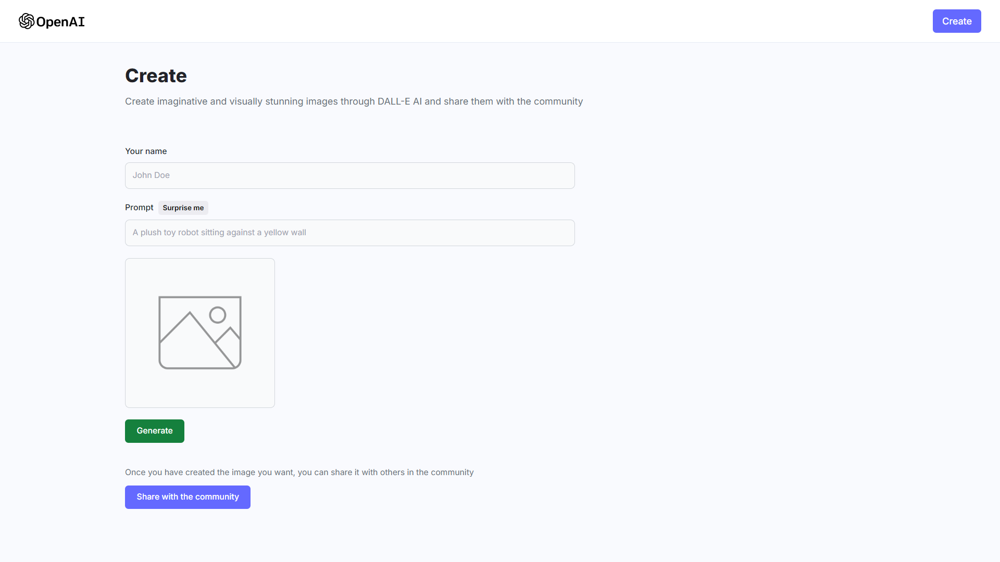

# MERN AI Image Generation App



### Cloning the repository

```shell
git clone https://github.com/bintangnugrahaa/ai-image-generation.git
```

### Install packages

```shell
npm install
```

### Setup .env file


```js
OPENAI_API_KEY=

MONGODB_URL=

CLOUDINARY_CLOUD_NAME=
CLOUDINARY_API_KEY=
CLOUDINARY_API_SECRET=
```

### Start the app

```shell
npm run dev
```